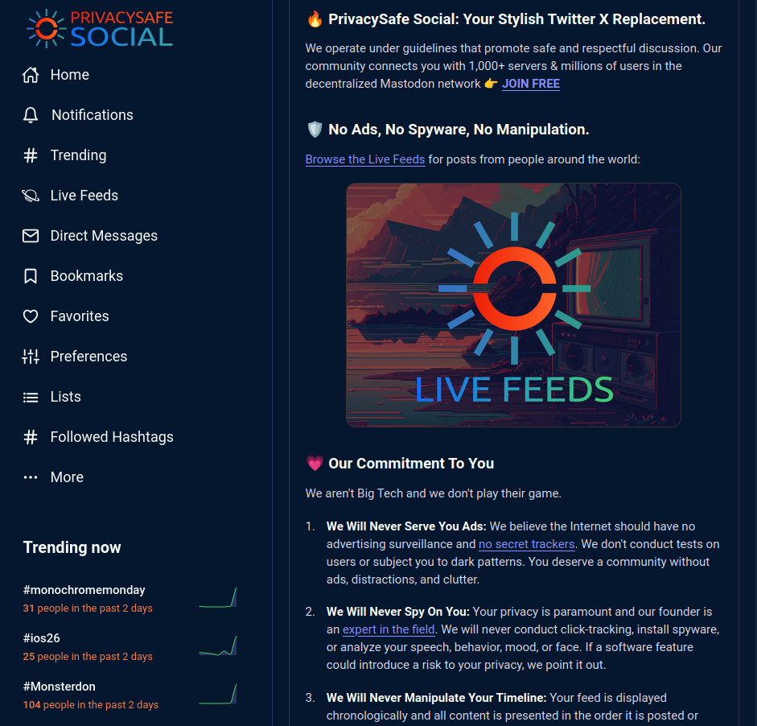
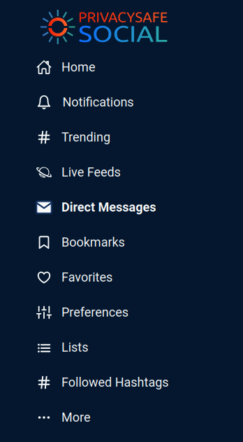
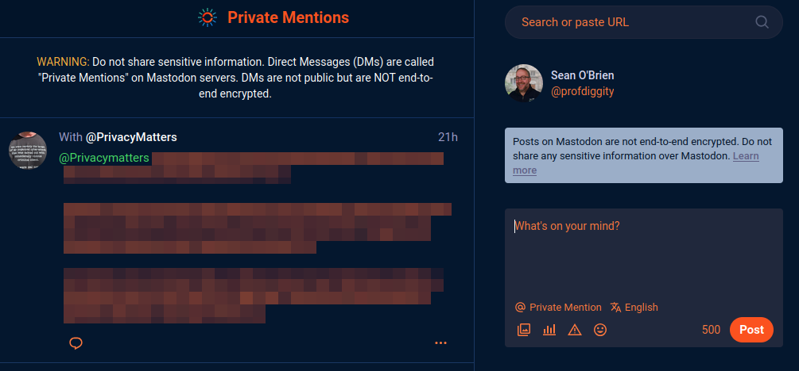
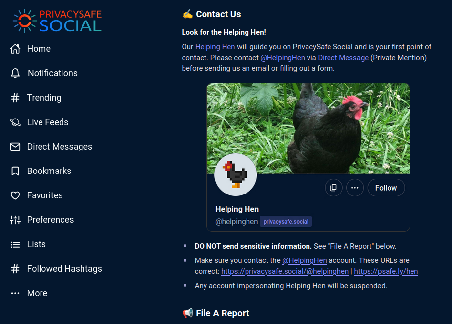
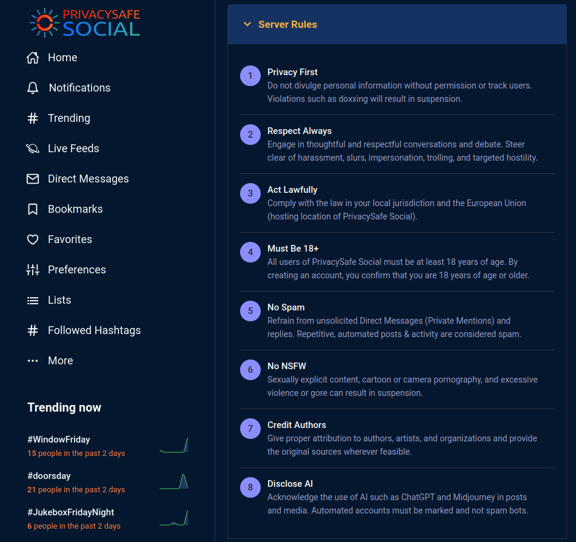
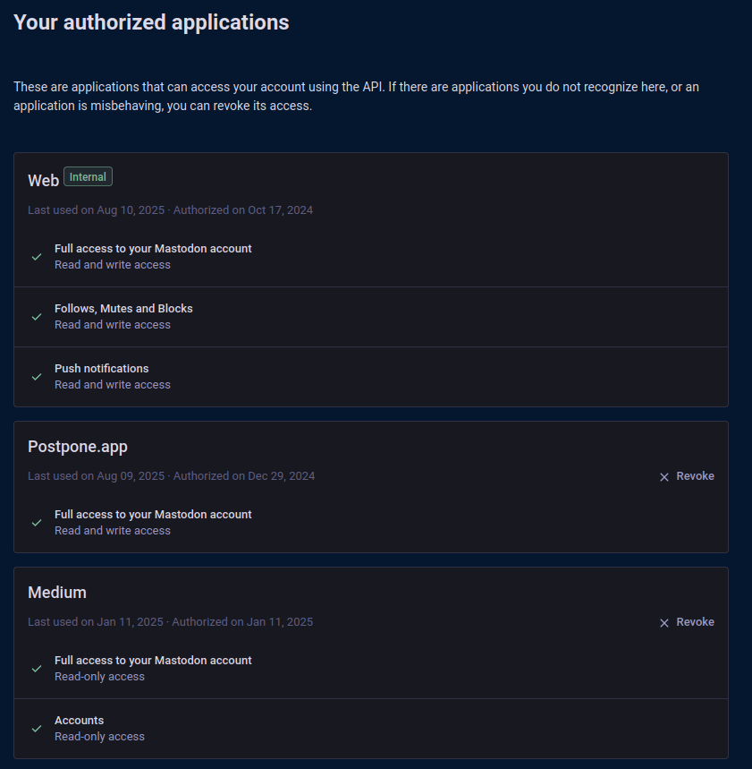

  # PrivacySafe Social

  

  ## No Ads, No Spyware, No AI Manipulation. Simple Rules, Honest Moderation, Zero Fees.

Sign Up for Free at [privacysafe.social](https://privacysafe.social/auth/sign_up) and liberate your social life. Our community connects you with 1,000+ servers & millions of users in the decentralized Mastodon network.

  
   
  <em>Live Feed at <a href="https://privacysafe.social">https://privacysafe.social</a></em>

**This repository contains our style modifications to the default Mastodon look and feel. Please see the file `layout-privacysafe-social.css` for our stylesheets.**

Our theme for PrivacySafe Social is modified from [mastodon-bird-ui](https://github.com/ronilaukkarinen/mastodon-bird-ui) by [Roni Laukkarinen](https://github.com/ronilaukkarinen).

---

## Usability

* Familiar look and feel, closer to Bluesky or Twitter X.
* Message publishing choices such as "Public: Anyone in the World" and "Followers Only"
* DMs are called "Direct Messages" replacing the confusing Mastodon term "Private Mentions"
* Live Feeds are one click away, without requiring an account.
* @HelpingHen is a friendly account that helps onboard and support users.
* Powerful full-text search, not just tags and usernames.

  
   
  <em>Easily Browse Live Feeds</em>

  
   
  <em>Updated Navigation Menu</em>

  
   
  <em>Message Publishing Choices</em>

  
   
  <em>Warnings for "Private Mentions" (Direct Messages)</em>

  
   
  <em>@HelpingHen account</em>

---

## Transparency

* Moderation numbers published with a public list of moderated servers and reasons
* Guidance for crisis resources, help lines, and abuse reporting
* GDPR compliant privacy policy, terms of service, and bug bounty program
* 8 Simple Rules articulated in plain English
* Runs on 100% Free and Open Source Software

  
   
  <em>8 Simple Rules</em>

  
   
  <em>Moderation numbers</em>

  
   
  <em>Crisis resources</em>

---

## Privacy

* No ads, no tracking, no click experiments, no dark patterns
* Profiles are opted out of the user directory by default
* Search engines are discouraged from indexing profiles by default
* External referrer sharing is disabled by default
* Options for automated post deletion
* Control who can see and interact with your profile and posts
* Completely delete your account

  
   
  <em>Search engine privacy</em>

  
   
  <em>Settings for automated post deletion</em>

  
   
  <em>Control post visibility</em>

  
   
  <em>Control post interaction</em>

  
   
  <em>Completely delete your account</em>

---

## Security

* Two Factor Authentication (2FA) support
* Security reporting with PGP and a public bug bounty program
* Session login history and revocation
* Authentication history for security audits

  
   
  <em>Set up Two Factor Authentication (2FA)</em>

  
   
  <em>View and revoke login sessions</em>

  
   
  <em>View a history of past sign-ins</em>

---

## Interoperability

* Connect with millions of users across thousands of servers in a decentralized network
* Import and export your data in an open format to easily move your account
* Authorize outside apps to interact with your account
* Develop your own apps to interact with your account

  
   
  <em>Import an account</em>

  
   
  <em>Export your data</em>

  
   
  <em>Authorize applications</em>

  
   
  <em>Develop applications</em>

---

## Autonomy

* No AI manipulation of timelines, no AI moderation or suggestions
* Timeline and live feeds load automatically in chronological order
* Simple preferences and controls throughout the UI
* Easily filter content by keywords, phrases, and hashtags
* Control media visibility and sensitive media

  
   
  <em>Create a filter</em>

  
   
  <em>Example of a NSFW filter</em>

  
   
  <em>Manage filters</em>

  
   
  <em>Block or hide all media or content marked sensitive</em>

  
   
  <em>Email notification settings</em>

---

## License
© 2024-present <a href="https://ivycyber.com" target="_blank">Ivy Cyber LLC</a>. This project is dedicated to ethical <a href="https://fsf.org" target="_blank" rel="noreferrer noopener">Free and Open Source Software</a> and <a href="https://oshwa.org" target="_blank" rel="noreferrer noopener">Open Source Hardware</a>. PrivacySafe® is a registered trademark.

Released under the [MIT/Expat License](LICENSE). See [LICENSE](LICENSE) for more information. Our theme for PrivacySafe Social is modified from [mastodon-bird-ui](https://github.com/ronilaukkarinen/mastodon-bird-ui) by [Roni Laukkarinen](https://github.com/ronilaukkarinen).

